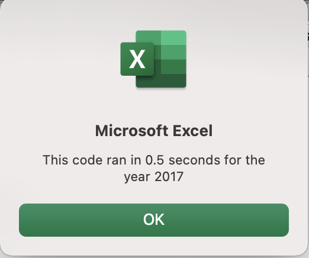
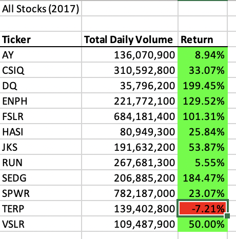
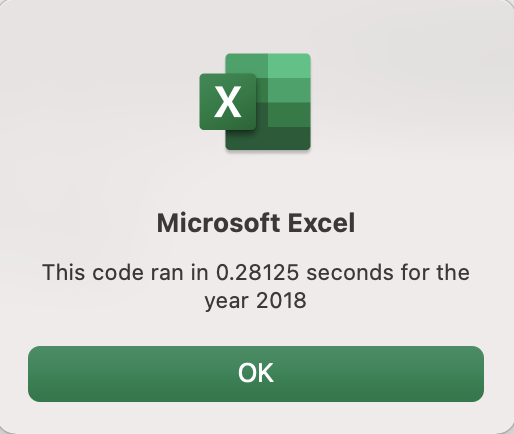
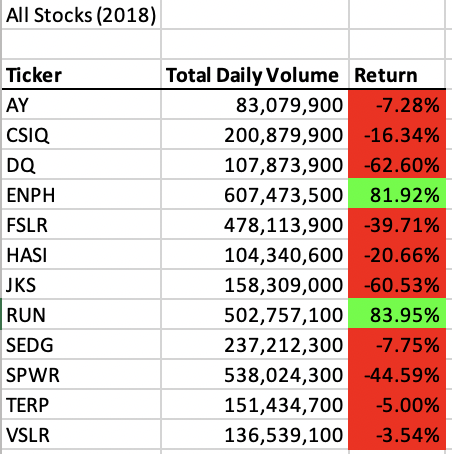
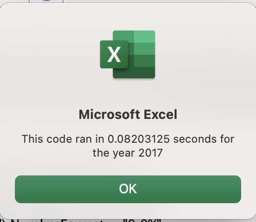
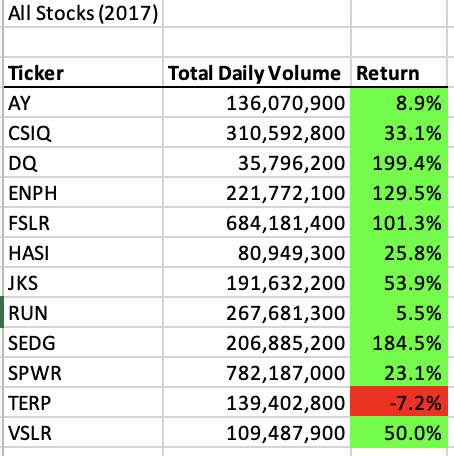
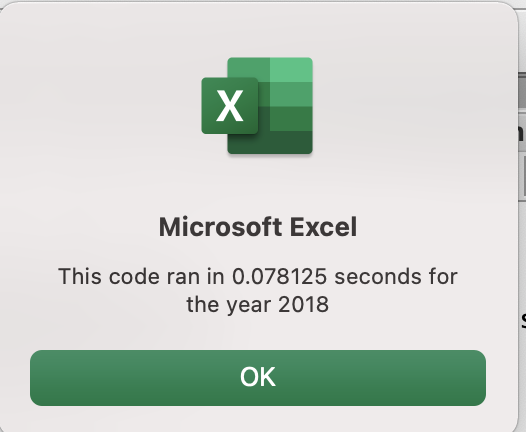
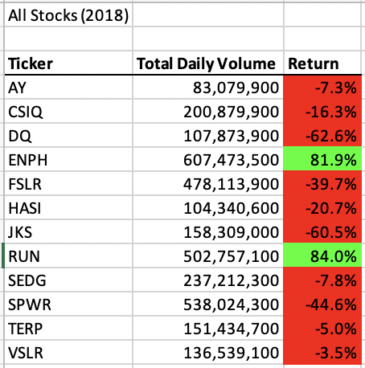

# stock-analysis
Bootcamp Module Two VBA Portfolio Project 
# Overview of Project
The purpose and background are well defined (2 pt).
# Results
The analysis is well described with screenshots and code (4 pt).
 

# Summary
There is a detailed statement on the advantages and disadvantages of refactoring code in general (3 pt).
There is a detailed statement on the advantages and disadvantages of the original and refactored VBA script
